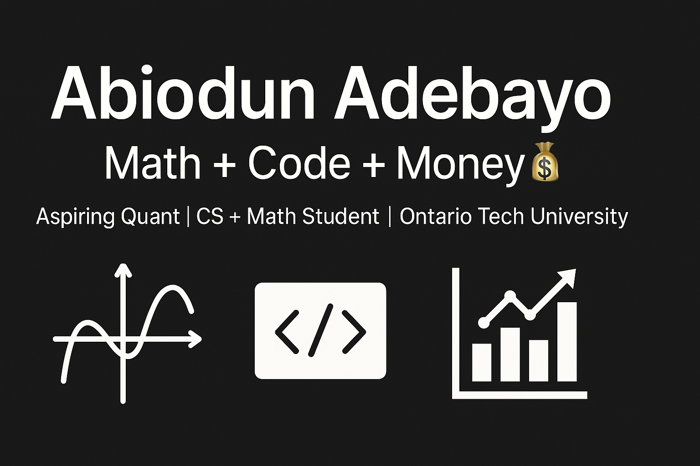

<!-- Banner -->

  

# 👋 Hi, I'm Abiodun Adebayo!

🎓 I'm studying **Integrated Mathematics and Computer Science** at Ontario Tech University (Canada).  
💡 I'm passionate about **Quantitative Finance**, **Algorithms**, and **Data Science**.  
🚀 I'm on a journey to become a **Quant Analyst** — solving [LeetCode](https://leetcode.com/u/Biodunseyi/) problems, building real-world projects, and mastering math + code.

---

## 🧠 Skills & Interests

---

## 📘 Projects & Practice

- 🔢 [LeetCode Solutions](https://github.com/biodunseyi/leetcode-solutions) — SQL, C++, Java problems (🛠️ Ongoing)
- 📈 **Portfolio Optimizer** — Modern Portfolio Theory (MPT) tool using Python, NumPy, and Streamlit (🛠️ In Progress)
- 📉 **Quant Backtesting Engine** — Strategy backtester using `pandas`, `yfinance`, and real historical data (🛠️ Coming Soon)
- 🧠 **AI Stock Predictor** — LSTM/Transformer time-series predictor for equities (🛠️ Coming Soon)
- 📊 **Finance Dashboard** — Real-time investment dashboard (Streamlit + Plotly + API) (🛠️ Coming Soon)
- 🧮 **Linear Algebra Visualizer** — Interactive matrix transformation visualizer in 2D/3D (🛠️ In Progress)

---

## 📊 GitHub Stats

  
  

---

## 📈 GitHub Activity Graph

---

## 🧠 LeetCode Stats

---

## 🔗 Connect With Me

- [💼 LinkedIn](https://www.linkedin.com/in/adebayo-abiodun-8b3332245/)
- [💻 GitHub](https://github.com/biodunseyi)
- [🧠 LeetCode](https://leetcode.com/u/Biodunseyi/)

---

## 🚀 Currently Working On

- 🧠 Daily LeetCode (C++, SQL, Java)
- 📈 Portfolio Optimization and Financial Modeling Projects
- 🎯 Preparing for grad school: **Princeton (MFin)**, **MIT (AI/Data Science)**, **Harvard (MBA)**

---

## ⚡ Fun Fact

> “I am the hope of my family — and I'm building a future where **math and code meet money**.” 💸🔥
